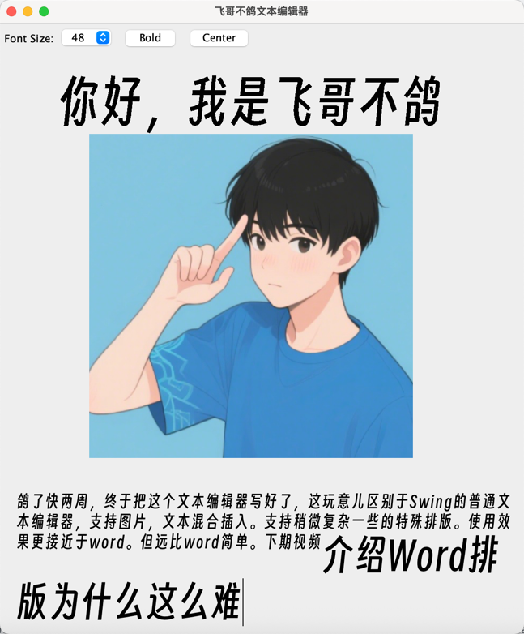

# MyFullTextEditor

富文本编辑器, 基于gof的设计模式实现.

# v1
脱离所有swing的输入组件, 譬如JTextPane等, 通过基本的Panel实现一个独立的文本编辑器
通过将所有元素抽象成`Glyph`接口, 实现了基本内容的绘制
目前支持基本的文本编辑功能, 包括:输入文本, 鼠标移动, 光标绘制

# v2

实现了基本的文本编辑功能, 包括:输入文本, 鼠标移动, 光标绘制, 粘贴, 拖拽, 剪切板等功能.
支持文本，图片的混合排版.

